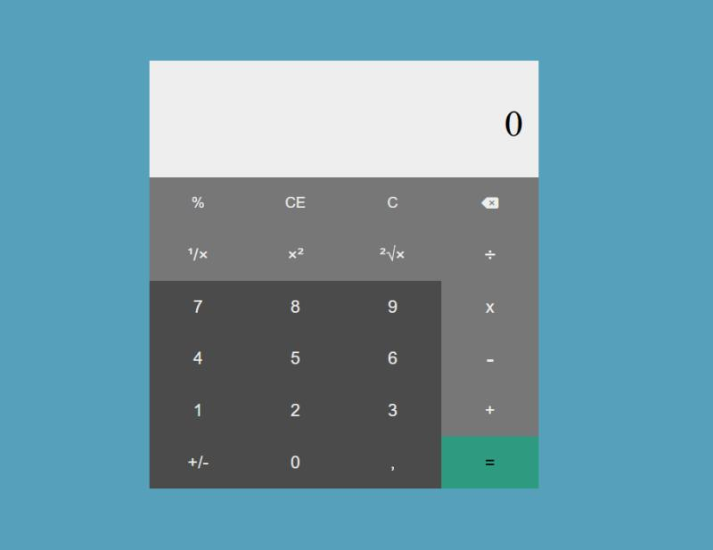

# Calculadora

**Calculadora** é um projeto inspirado na calculadora do Windows, trazendo diversas funcionalidades além das operações básicas. Desenvolvido com **HTML**, **CSS** e **JavaScript**, o aplicativo oferece uma interface simples e intuitiva para realizar cálculos matemáticos.

## Funcionalidades

- Operações básicas:
  - Soma (+)
  - Subtração (-)
  - Multiplicação (×)
  - Divisão (÷)
- Funcionalidades avançadas:
  - Porcentagem (%)
  - 1 dividido por x (1/x)
  - Potenciação (x²)
  - Raiz quadrada (√x)

## Imagem do Projeto



## Tecnologias Utilizadas

- **HTML**: Para estruturar o layout da calculadora.
- **CSS**: Para estilizar e criar uma interface amigável.
- **JavaScript**: Para implementar a lógica das operações matemáticas.

## Como Rodar o Projeto

1. Clone o repositório:
   ```bash
   git clone https://github.com/seu-usuario/calculadora-avancada.git
2. Navegue até a pasta do projeto:
    ```bash
    cd calculator-js

## Links

- Jogue o jogo da memória: [Calculadora](https://damilhome.github.io/calculator-js/)
- Conecte-se comigo no [LinkedIn](https://www.linkedin.com/in/danilo-almeida-milhome/)